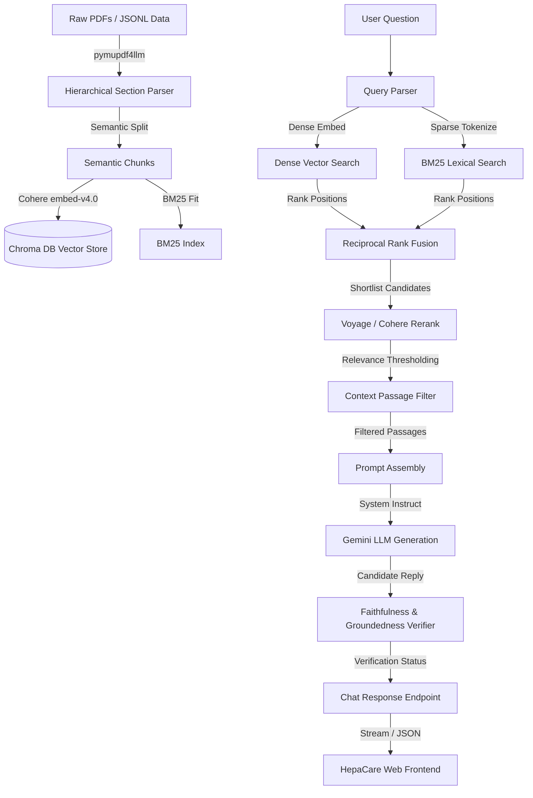

# Clinical Hepatology RAG System & HepaCare AI

A production-grade Clinical Retrieval-Augmented Generation (RAG) system specialized in liver diseases, hepatology diagnostics, and screening guidelines. The system combines medical patient guides (from NIDDK) and clinical practice guidelines (from USPSTF) into a searchable vector index to power a clinical chatbot with real-time faithfulness verification and liver wellness telemetry assessment.

---

## 🌟 Key Features

### 1. Advanced Ingestion & Semantic Chunking
- **Structure-Aware PDF Parsing**: Ingests clinical PDFs (e.g. USPSTF statements) into hierarchical section blocks preserving Markdown header paths (`H1 > H2 > H3`) using `pymupdf4llm`.
- **Semantic Text Chunking**: Extracts paragraphs, cleans text for embeddings, and applies semantic paragraph split boundaries to ensure contextual coherence.

### 2. Hybrid Multi-Stage Retrieval Flow
- **Lexical Leg (BM25)**: Tokenizes alphanumeric medical terms (keeping tokens like `HBsAg` and `anti-HCV` intact) for exact term matching.
- **Dense Leg (Cohere Embeddings)**: Computes high-dimensional dense embeddings using Cohere's `embed-v4.0` (1024d) stored in a persistent Chroma DB vector store.
- **Reciprocal Rank Fusion (RRF)**: Fuses lexical and dense retrieval ranks using RRF ($K=60$) to balance exact-match accuracy with semantic generalization.
- **Raw Query Preservation**: Searches both LLM-rewritten query expansions and the user's raw query terms in parallel to avoid loss of context from poor LLM translations.
- **Dual-Model Reranking**: Re-orders candidate chunks using cross-encoders (Cohere `rerank-v3.5` or Voyage `rerank-2.5`) with built-in API throttling to handle rate limits gracefully.

### 3. Generation & Automated Verification
- **Constrained Medical Scope**: Restricts LLM responses strictly to retrieved documents; implements a strict prompt syntax structure (`Answer:`, `Evidence:`, `Citation:`).
- **Automated Verification Pipeline**: Evaluates candidate generation against retrieved context in real-time to assess *Faithfulness*, *Groundedness*, *Citation Validity*, and *Absence of Personalization*.
- **Out-of-Scope Fallbacks**: Detects small talk, non-medical greetings, and queries with insufficient retrieved context to output safe pre-configured medical disclaimers.

### 4. Full REST API & Interactive UI
- **FastAPI Backend**: Exposes streaming generation APIs, index rebuild hooks, retrieval endpoints, conversation chat logs, and automated assessment endpoints.
- **HepaCare AI Portal**: A modern SPA web interface featuring:
  - **Conversational Chat**: Interactive chat with conversational history memory.
  - **Source Transparency**: Clickable citations pointing to exact document paths and chunk IDs.
  - **Audit Notes Panel**: Real-time display of LLM verifier audit results, groundedness scores, and validation reports.
  - **Wellness Telemetry**: A simulated health assessment scoring liver wellness based on user-provided metrics (e.g., fatigue level, pain location, dietary adherence).

---
## 🎥 Project Demo

Watch the **Clinical Hepatology RAG System & HepaCare AI** in action:

https://github.com/MohamedAlaa2005/Clinical-Hepatology-RAG-System-HepaCare-AI/assets/141934524/638668480-510e86da-69eb-4787-b8b2-20b8c3bcea8a

## 🏗️ System Architecture



---

## 📂 Project Structure

```
├── app.py                     # CLI Tool & Server Launcher
├── Dockerfile                 # Docker configuration
├── .dockerignore              # Excluded files for Docker build
├── requirements.txt           # Project Dependencies
├── retrieval_test.py          # Interactive Evaluation & Retrieval Test Utility
├── .env.example               # Example Configuration Variables
├── data/
│   ├── raw/                   # Raw PDFs & NIDDK patient page JSONL datasets
│   ├── processed/             # Parsed and chunked documents
│   └── chroma/                # Chroma Vector DB persistence store
├── docs/                      # Evaluation reports & performance comparison charts
└── src/
    ├── api/                   # FastAPI routing, app initialization, and schemas
    ├── config.py              # Global paths, model variables, and configurations
    ├── evaluation/            # Custom RAGAS metrics & retrieval precision/recall benchmark code
    ├── fornt/                 # Single Page Application Web Client (index.html, assets)
    ├── generation/            # RAG pipelines, LLM interfaces, and verifier logic
    ├── indexing/              # PDF parsing, semantic chunking pipelines
    ├── retriever/             # BM25 leg, dense leg, query parser, RRF fusion, and rerankers
    └── vector_db/             # Chroma database client and collection builders
```

---

## 🛠️ Installation & Setup

1. **Clone the repository**:
   ```bash
   git clone <repository-url>
   cd instant_hackthon
   ```

2. **Create and activate a virtual environment**:
   ```bash
   python -m venv venv
   # On Windows:
   venv\Scripts\activate
   # On macOS/Linux:
   source venv/bin/activate
   ```

3. **Install dependencies**:
   ```bash
   pip install -r requirements.txt
   ```

4. **Configure Environment Variables**:
   Create a `.env` file in the root directory:
   ```bash
   cp .env.example .env
   ```
   Open `.env` and enter your API credentials:
   ```env
   COHERE_API_KEY=your-cohere-api-key
   GEMINI_API_KEY=your-gemini-api-key
   
   # Optional: Set Voyage key to use Voyage Rerank (default is Cohere)
   VOYAGE_API_KEY=your-voyage-api-key
   ```

---

## 🚀 Running the System

The main entry point is `app.py`.

### 1. Ingest Data & Rebuild Index
To parse the raw files and rebuild the vector database:
```bash
python app.py --index
```
*Note: If the system detects a missing chunk file or vector database on startup, it will run indexing automatically.*

### 2. Run Local CLI Queries
To test a query directly in your terminal without starting the web server:
```bash
python app.py --query "What is the recommended age group for Hepatitis C screening?" --top-k 5
```

### 3. Start the Web Server
To launch the FastAPI backend server and serve the frontend UI:
```bash
python app.py --host 127.0.0.1 --port 8000
```
Once started:
- Access the **HepaCare AI Frontend** at [http://127.0.0.1:8000/](http://127.0.0.1:8000/)
- Access the **Interactive API Docs (Swagger)** at [http://127.0.0.1:8000/docs](http://127.0.0.1:8000/docs)

### 4. Run with Docker
You can build and run the application in a lightweight container:

**Build the Docker image**:
```bash
docker build -t hepatology-rag .
```

**Run the container**:
```bash
docker run -p 8000:8000 --env-file .env hepatology-rag
```
Once started, the HepaCare AI Frontend will be available at [http://localhost:8000/](http://localhost:8000/).

---

## 📊 Evaluation & Testing

The repository provides a testing CLI `retrieval_test.py` to assess retrieval metrics.

### Command Options
- **Interactive Menu**: Run without arguments to launch a guided testing menu:
  ```bash
  python retrieval_test.py
  ```
- **Benchmarking**: Run evaluation against a ground-truth dataset (Precision, Recall, MAP, MRR):
  ```bash
  python retrieval_test.py --eval data/eval/queries.jsonl -k 5
  ```
- **Direct CLI Search**: Test retrieval performance for a single search string:
  ```bash
  python retrieval_test.py "What are symptoms of cirrhosis?" -k 5
  ```

Outputs are saved automatically under the `docs/` folder:
- Individual query logs: `docs/retrieval_results.txt`
- Full evaluation reports: `docs/evaluation_report.txt`
